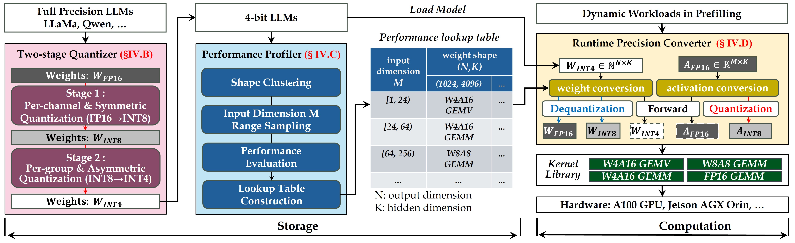
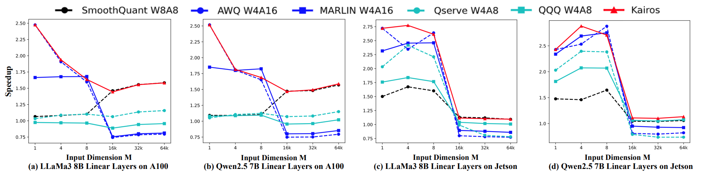
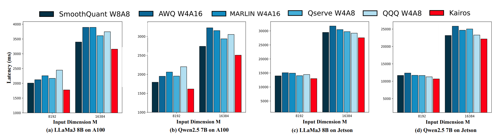

# Kairos
Kairos is a framework to accerelate quantized LLM inference.
Our key idea is to decouple storage and computation.
For storage, a 4-bit weight quantization is used to reduce memory overhead. 
For computation, different quantization strategies are used to accelerate prefilling at runtime.

 
We decouple the storage of weights of linear layers and the computation of linear layers.
Kairos consists of quantizer, profiler, and converter.
The quantizer compresses a full precision LLM into a 4-bit LLM.
The profiler explores the quantization strategy to construct a lookup table for each linear layer.
The converter converts the weights and activations based on the given quantization strategy.

## Install
Install environment

1. Install Package for CUDA Device
    `CUDA12.6 + torch2.6`

```
conda create -n kairos python=3.10 -y
conda activate kairos
pip install --upgrade pip
# pip install --extra-index-url https://download.pytorch.org/whl/cu126 torch==2.6.0
pip install --extra-index-url https://mirrors.nju.edu.cn/pytorch/whl/cu126 torch==2.6.0
pip install -e .
```

2. Compile CUDA Kernels

```
sh script/compile_kernel.sh
```

## Evaluation
Speedup of Linear Layers Evaluation

```
bash script/linear_layer_speedup.sh
# echo DynamicLinear | python -m eval.eval_llm_linear --model_type llama
```

Speedup of Linear Layers Evaluation

```
bash script/end2end_latency.sh
```

## Performance
Kairos provides 1.57×, and 1.63× speedups on average for LLaMa-3 8B, and 1.47×, and 1.61× speedups on average for Qwen2.5 7B A100 GPU, compared with SOTA W4A16 method MARLIN and W4A8 method Qserve, respectively.
We also evaluate the performance of Kairos on Nvidia Jetson AGX Orin.
When the input dimension is set to 64K, 
Kairos provides up to 1.27×, 1.42× and 1.40× speedups for LLaMa-3 8B, 
and up to 1.23×, 1.38× and 1.54× speedups for Qwen2.5 7B, 
compared with MARLIN, AWQ and Qserve, respectively.
The overall performance of Kairos is significantly higher than other quantization methods.
This is because Kairos decouples storage and computation for dynamic workloads in LLM prefilling.
In addition, the performance of Kairos is optimal for some specific workloads.
This is because the optimal strategies are different among the linear layers of different weight shapes.
 
 
